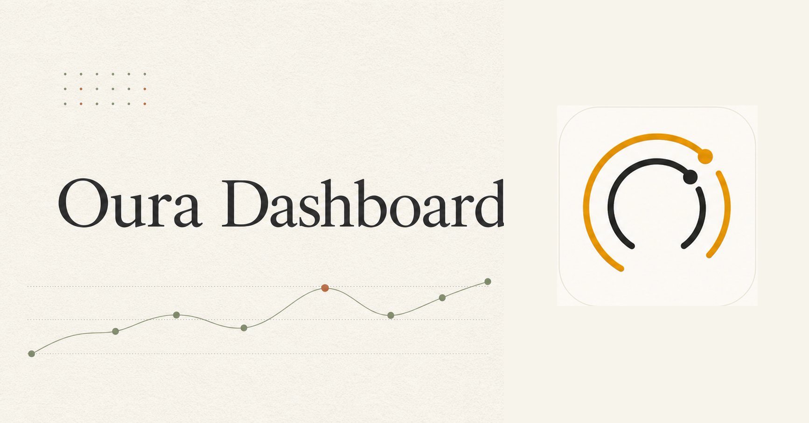

# Oura Dashboard

Oura Dashboard is a self-hosted, multi-profile dashboard for Oura health data.
It keeps each hosting account and Oura profile isolated, stores OAuth tokens
encrypted at rest, and shows cached daily health aggregates without putting raw
Oura responses in the browser.



## What it includes

- Individual and family views for readiness, sleep, activity, overnight body
  signals, stress and recovery, movement, and aggregate workouts.
- Separate owner and guest Oura OAuth flows. Guests can authorize a profile
  without gaining access to the dashboard.
- Tenant-scoped Cloudflare D1 storage with encrypted Oura access and refresh
  tokens.
- Fail-closed owner access through either ChatGPT Sites identity or a verified
  Cloudflare Access JWT.
- Device-timezone refresh windows. The app does not infer location from IP and
  does not query or store Google Calendar data.

This is a personal dashboard, not a medical device. It does not make medical
or causal claims.

## Choose a hosting path

| Target | Identity | Start here |
| --- | --- | --- |
| ChatGPT Sites | Signed-in ChatGPT Sites identity | [Deploy to ChatGPT Sites](docs/deploy-chatgpt-sites.md) |
| Cloudflare Workers | Cloudflare Access | [Deploy to Cloudflare](docs/deploy-cloudflare.md) |

Both paths require a D1 database, an Oura OAuth application, and the runtime
values in [Configuration](docs/configuration.md). Operator-specific files are
ignored; copy one of the tracked examples before deployment.

## Oura callback URLs

Register both callbacks in the Oura developer portal, replacing
`https://dashboard.example.com` with your deployed origin:

```text
https://dashboard.example.com/api/oura/callback
https://dashboard.example.com/api/oura/guest/callback
```

The owner callback must stay behind the selected identity provider. The guest
callback is intentionally public and accepts only a short-lived, server-issued
guest state.

## Local development

Requires Node.js 22.13 or newer.

```bash
npm ci
cp .env.example .env.local
npm run dev
```

The D1 logical binding is `DB`; migrations live in `drizzle/`. Local owner
routes fail closed unless the request arrives through a supported trusted
identity boundary. Do not weaken authentication or forge identity headers for
production.

Before submitting or deploying a change, run:

```bash
npm run audit:public
npm test
npm run typecheck
npm run lint
```

## Privacy and security

The repository contains synthetic fixtures only. A deployment processes the
health data and account identifiers supplied by its operator and users. Read
[Privacy](PRIVACY.md) before hosting it, keep runtime secrets out of Git, and
follow [Security](SECURITY.md) to report a vulnerability privately.

The public-artifact audit checks the release boundary for operator config,
credentials, production resource identifiers, local paths, non-example email
addresses, and optional private denylist terms:

```bash
npm run audit:public
```

## Project structure

- `app/` contains Next-compatible pages and route adapters.
- `features/` owns dashboard, profile, health-data, and Oura behavior.
- `platform/` owns authentication, D1/Drizzle, runtime bindings, and security.
- `shared/` contains feature-neutral async and UI primitives.
- `tests/` mirrors those owners and is discovered by `scripts/run-tests.mjs`.

See [Contributing](CONTRIBUTING.md) for safe fixture and testing rules. Agent
workflows are documented in [docs/agents](docs/agents/README.md).

## License

MIT. See [LICENSE](LICENSE).
